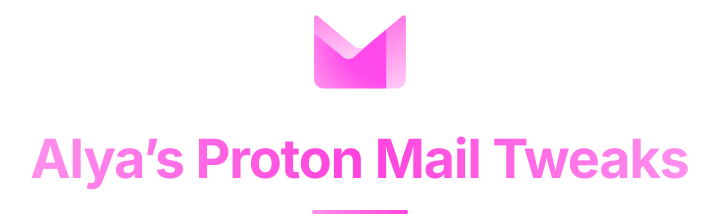

A set of CSS tweaks that make Proton Mail's web UI denser, prettier and drop the parts you never use.

### [Configure & Install](https://proton-mail-tweaks.henkys.dev)

 

## How to use

1. **Install [Stylus](https://add0n.com/stylus.html)** for
   [Firefox](https://addons.mozilla.org/firefox/addon/styl-us/) or
   [Chrome](https://chromewebstore.google.com/detail/stylus/clngdbkpkpeebahjckkjfobafhncgmne),
   or any other extension that can apply custom user CSS.
2. **Configure it to your liking** on
   [proton-mail-tweaks.henkys.dev](https://proton-mail-tweaks.henkys.dev). It comes with reasonable defaults for the layout, you have to choose yourself which features you want to hide.
3. **Press Install in Stylus.** Every switch and every slider stays adjustable afterwards in Stylus' own settings panel.

## Features

- **Compact sidebar** - configurable row height & row gaps
- **Compact mail list** - configurable padding & selection box size | column mode on a single line
- **Remove Starred** - removes starred feature entirely
- **Remove Views, Folders, Labels** - each sidebar section on its own switch, optionally everywhere else too
- **Remove More/Less Sidebar button** - optionally hides the folders behind it as well
- **Taller "Label as" and "Move to" dialogs** - actually see more than 5 items
- **Bold senders** - sets the sender apart from the subject in column mode
- **Accent the folder icons** - Archive and Sent markers in the theme accent color
- **Restyle conversation count** - bold & accent color
- **Steady hover buttons** - stops the row growing as the pointer passes
- **Attachments as chips** - shrinks comfortable density's attachment buttons to label chips

Every tweak can be switched individually, some are slider-configurable.

## Compatibility

| Version | Compability |
| --- | --- |
| 5.0.132.2 | ✅ |
| Pre 5.0.132.2 | ❌ |

| Style | Compability |
| --- | --- |
| Column mode | ✅ |
| Row mode | ✅ |
| Compact density | ✅ |
| Comfortable density | ✅ |
| Themes | ✅ |

I use Proton Mail every day and could not live without these tweaks. So my incentive to keep this up-to-date being my own autistic need for compact user interfaces is as good as a promise you can get. If something doesn't work, feel free to [open an issue](https://github.com/telefonsquid/alyas-proton-mail-tweaks/issues).

## AI disclaimer

The first set of these tweaks were hand written, by me, for me. But maintaining that every time an update changes something slighly would be more hassle than the tweaks are worth, so upkeep is now handled by Claude. The configurator and adjustable Stylus variables were also built with Claude.

## Not affiliated with Proton

Proton and Proton Mail are trademarks of Proton AG. This is an unofficial third party stylesheet, made by a user, with no involvement from or endorsement by Proton.

## License

MIT. See [LICENSE](LICENSE).
